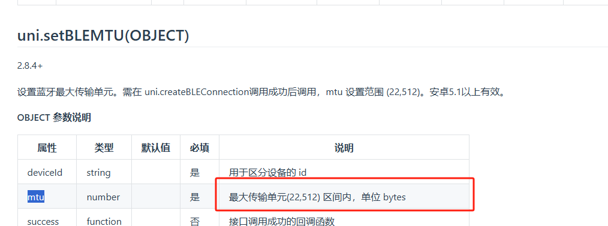

# 前言

* 本规范针对产品经理，开发工程师，测试工程师编写。
* 本规范介绍了BLE等技术。了解过这些基本技术后，就会明白如何将智能戒指的功能集成到自己的APP中。
* 此份SDK提供了两种接口类型，IOS和安卓。针对跨平台的场景（比如fluter，uniapp，qt）使用这两种库需要技术人员自行移植。暂无小程序语言的API，需要使用私有协议开发。

小程序开发有个注意点，因为历史记录数据长度很长（247左右），小程序在Android手机上，默认接收的数据长度很短，需要设置一下长度，设置稍微大一些，

<figure><figcaption></figcaption></figure>

| 安卓 | IOS | Fluter | uniapp | 小程序  |
| -- | --- | ------ | ------ | ---- |
| 支持 | 支持  | 自行移植   | 自行移植   | 协议开发 |

## 1.智能戒指的蓝牙状态

低功耗蓝牙简称BLE，技术连接参考：[低功耗蓝牙技术](http://doc.iotxx.com/BLE%E6%8A%80%E6%9C%AF%E6%8F%AD%E7%A7%98)。将会以智能戒指为例介绍BLE相关技术。\
智能戒指的低功耗蓝牙共分为三种状态：广播状态，连接状态，关机状态。

### 1.1.广播状态

在广播状态下，智能戒指会以500ms到1000ms不等的时间间隔发送广播，广播的内容包含了设备的MAC地址，蓝牙名称，自定义数据。\
在蓝牙的通讯范围内（智能戒指一般为5米内）打开蓝牙的扫描功能，就能发现这个广播。\
下载蓝牙测试APP“nrf connect”（IOS手机能够从app store下载到，安卓可以从谷歌商店下载）。\
安装好APP后请观察下图中的红色字体的序号:

<figure><figcaption></figcaption></figure>

* 点击1后打开广播的筛选设置界面，在此界面下点击2，3可以筛选掉无蓝牙名字的广播设备，不设置过滤的话环境中有可能会有几十上百个设备，会使我们不方便分辨设备，智能戒指一定是有蓝牙名字的，所以我们选择“With name”。
* 点击3的滑点可以筛选RSSI。RSSI是信号强度，常规情况下为负值，值越大信号值越大，一般情况下戒指在贴近手机外壳的情况下大于-60dBm。所以我们可以将小于这个信号值的筛选掉不显示。
* 接下来就可以点击空白位置关闭掉筛选设置界面，点击5进行发现设备了。比较容易忽略的点是5位置的"SCAN"在蓝牙扫描状态下字体会变成"STOP SCANNING",当显示"SCAN"时候代表未执行扫描动作或者是扫描结束。

<figure><figcaption></figcaption></figure>

* 在上图中，将戒指放在手机旁边发现设备后在1的界面内，显示了蓝牙名称和MAC地址。点击1会展开，在2的界面内显示了一个详细的广播数据，其中最需要我们关注的就是Manufacturer data，此数据是自定义数据，尤其是0xFF11位置代表了，我们的设备所支持的协议版本，具体的应用方法以后会介绍到。目前我们就完成了戒指的广播测试。
* 如果您使用此方法扫描不到设备，请注意以下几点： 1.打开APP的蓝牙和定位权限。 2.确认戒指有电，可以一直放在充电座上测试。 3.确认戒指没有被其他手机连接，当智能戒指的蓝牙被连接后，广播会停止发送。 4.确认戒指没有被自己手机的APP后台，杀掉手机的后台程序，重新扫描。

### 1.2.连接状态

* 在连接状态下，可以进行戒指的应用协议测试。例如读取固件版本号，硬件版本号等。

### 1.3.关机状态

* 在关机状态下，戒指的蓝牙广播关闭，在这个状态下戒指进入了低功耗状态，如果想恢复广播状态需要充电唤醒。
* 但是如果冲电中超过半小时，确认这个戒指没有被其他手机连接且手机权限正常依然发现不了广播的话，戒指可能存在故障，请联系渠道商更换测试戒指。
