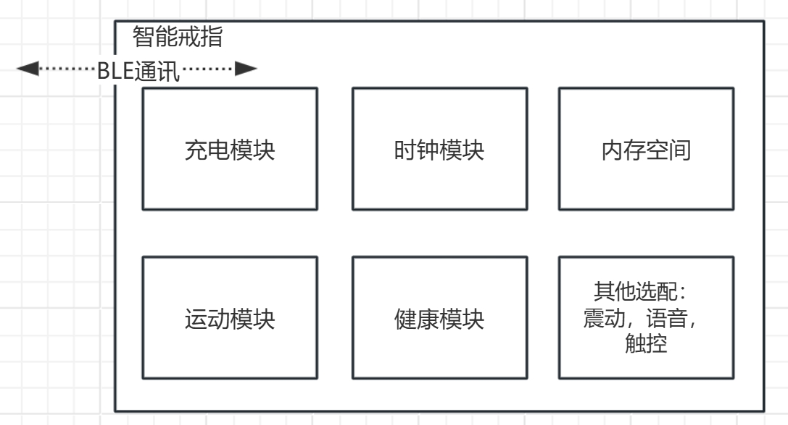

# 智能戒指的方案设计

### 指令使用注意点

鉴于用户经常出现指令调用出问题的时候，建议先查看一下指令使用的注意点，如果开发中，出现不好排查的Bug，也可以参考注意点，自我排查一下


[zhi-ling-shi-yong-zhu-yi-dian-zhong-yao.md](../zhi-neng-jie-zhi-sdk-shi-yong/zhi-ling-shi-yong-zhu-yi-dian-zhong-yao.md)


### 戒指功能框架

<figure><figcaption></figcaption></figure>

* 充电模块：可以获取到戒指的充电状态和电量。
* 时钟模块：保持时钟的运行。
* 内存空间：存储用户个性化配置和健康测量产生的数据记录。
* 运动模块：提供计步，运动功能的支持。
* 健康模块：戒指在佩戴中会自动触发健康测量，每次测量会存储一条数据记录在戒指内的存储空间。\
  戒指在蓝牙连接中，可以由APP触发健康测量，在健康测量的过程中，戒指会实时返回当前的测量结果和进度。测试完成后也会在存储空间内增加一条数据记录。
* 选配功能：待补充。
