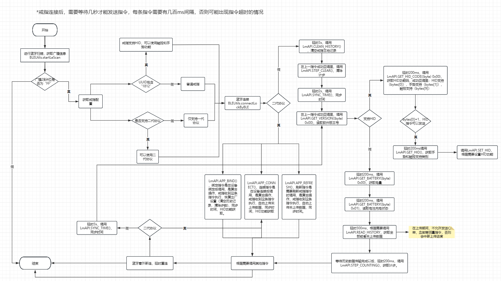
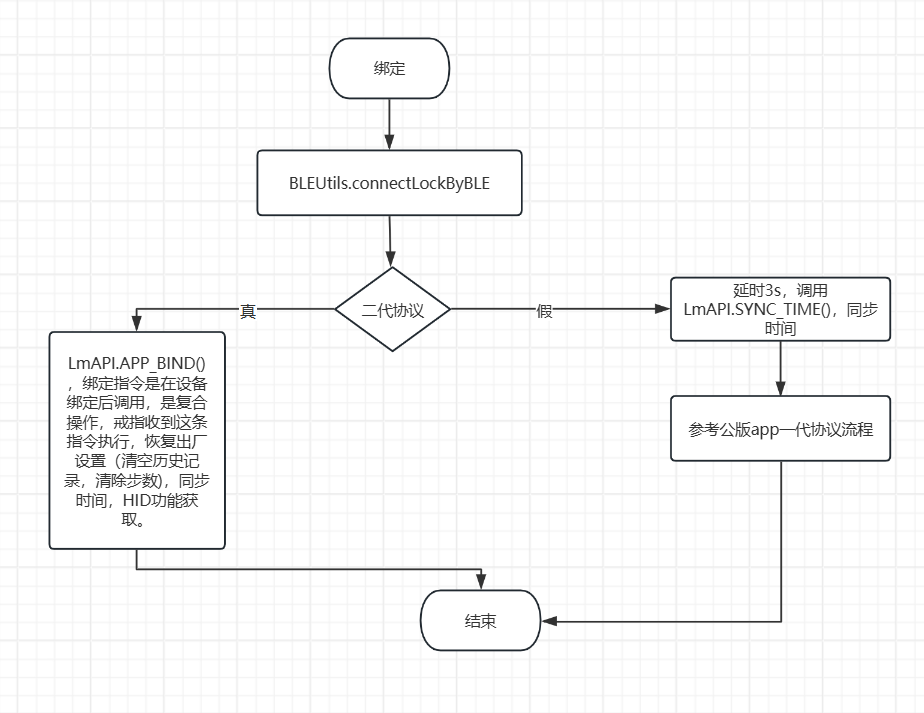
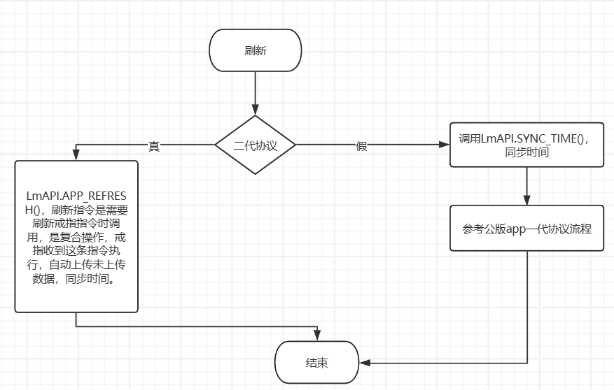

# 公版APP连接部分流程图

#### <mark style="color:red;">绑定，连接，刷新部分的指令操作，强烈建议使用复合指令。加快连接速度，减少指令冲突。</mark>


[er-dai-xie-yi.md](er-dai-xie-yi.md)


### 扫描到连接的总体流程

<figure><figcaption></figcaption></figure>

### 蓝牙绑定流程

<figure><figcaption></figcaption></figure>

### 蓝牙重连流程

<figure><figcaption></figcaption></figure>

### 蓝牙刷新流程

<figure><figcaption></figcaption></figure>

### 一代指令调用顺序

<figure><figcaption></figcaption></figure>
