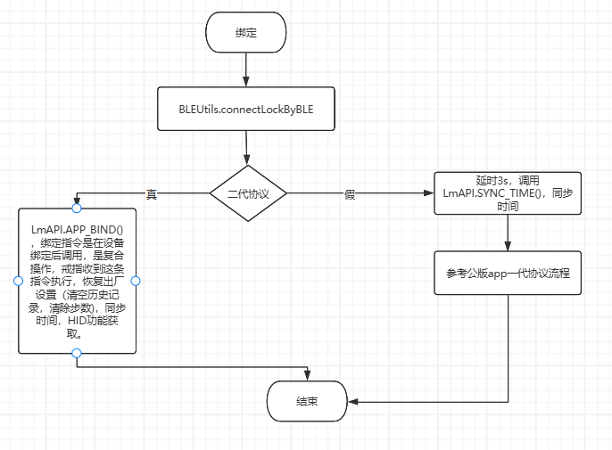
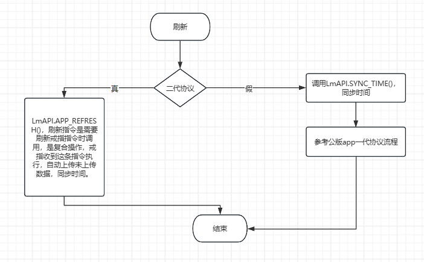

# sdk指令介绍

## 使用说明

<mark style="color:red;">蓝牙连接成功后，建议间隔1s以后再发送指令，防止设备没有准备好，指令超时。</mark>

<mark style="color:red;">指令使用过程中，不要同时调用多个指令，每个指令间隔200ms左右，如果多个指令同时运行，可能造成后续指令超时，也可能前边的指令按照后边指令的协议进行解析，造成不好排查的错误。例如：首页下拉刷新，调用刷新指令，可以保持刷新控件一直显示，防止重复刷新，在指令走完以后，可以再次刷新</mark>

## 设备连接后指令调用链

### 常规指令流程图（<mark style="color:red;">仅供参考，不推荐，容易出Bug，难以管控</mark>）

正常设备连接以后，需要获取多个指令，获取戒指信息，流程图如下（公版App的，用户可以根据需要选择指令，一般获取历史记录放在最后，时间比较长，而且获取历史记录期间，不允许主动测量，会报繁忙）

<figure><figcaption></figcaption></figure>

### 复合指令流程图（<mark style="color:red;">推荐使用</mark>）

<figure><figcaption></figcaption></figure>

<figure><figcaption></figcaption></figure>

<figure><figcaption></figcaption></figure>

## 指令分类

### 常规指令(<mark style="color:red;">不推荐</mark>)

这些指令，属于戒指的一些常规操作，包括：

* **同步时间**
* **读取时间**
* **版本信息**
* **电池电量**
* **读取步数**
* **清除步数**
* **恢复出厂设置**
* **采集周期设置**
* **采集周期读取**
* **读取历史记录**
* **清空历史数据**
* **设置蓝牙名称**
* **获取蓝牙名称**
* **一键自检**

### 主动测量指令

这些指令，是用户可以通过指令，控制戒指进行体征数据的测量，包括：

* **测量心率**
* **测量温度**
* **测量血氧**
* **测量血压和血糖（特定固件）**

### HID手势指令

这些指令是HID戒指，即需要系统蓝牙绑定的的戒指使用的，可以通过用户的上划下划手势，来控制音乐软件和视频软件的上下切换，通过捏一捏和捏一捏手势，控制手机相机拍照，包括：

* **获取HID功能码**
* **设置HID**
* **获取HID**

### 语音录制

支持语音的戒指，可以通过触摸戒指，或者通过App下发指令，控制戒指进行音频字节传输，传输到App上，App进行解析保存为音乐文件，或者将语音转换为文本，包括：

* **设置主动推送音频格式**
* **获取主动推送音频格式**
* **控制音频传输**

### 震动，闹钟

特定戒指可以进行震动功能，包括强力震动，渐变震动，持续震动。可以设置闹钟，定时来震动，闹钟模式包括一次，每天，智能节假日，智能工作日，指令包括：

* **设置戒指震动**
* **设置闹钟**
* **获取闹钟**

### 文件系统

特定戒指可以将用户的体征数据保存在戒指文件里，可以通过指令将文件读取出来，指令包括：

* **手动开启采集**
* **手动关闭采集**
* **请求文件列表**
* **格式化文件系统**
* **请求文件数据**
* **一键上传文件**

### 心电图

特定戒指提供心电图测量功能，用户可以将心电图数据解析，在页面上进行波形显示，也可以生成pdf报告，指令包括：

* **开启测量**
* **关闭测量**

### 厂家定制指令

我们为特定厂家，定制了一些指令，仅供定制厂家使用，包括：

* **实时PPG血压测量**
* **6轴协议**
* **寿世PPG波形传输**

