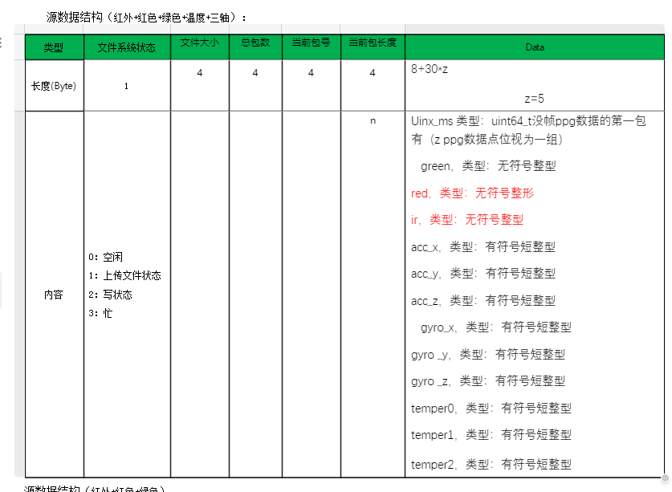
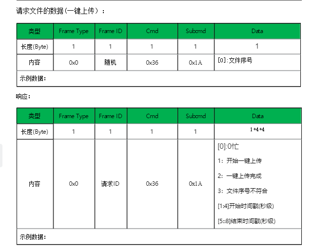
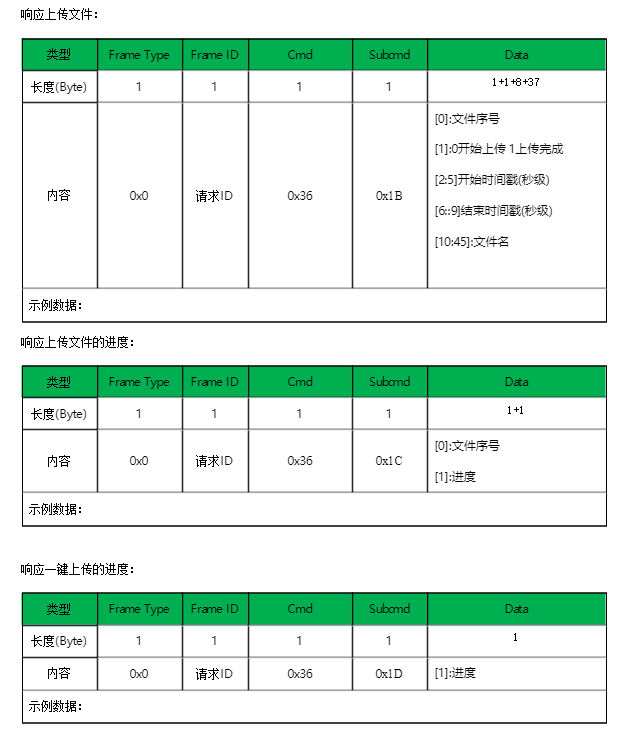
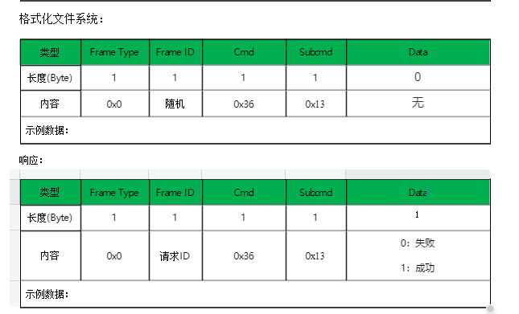

# 文件系统

### 一般指令

这种属于通用的文件系统，需要固件支持

**android:**

通过指令，可以获取戒指本地的文件列表，然后通过文件名，解析文件的内容(需要戒指支持指令) 对应的指令是：

```java
 LmAPI.GET_FILE_LIST( IFileListListener listenerLite) //文件列表
 LmAPI.GET_FILE_CONTENT( int mFileType,byte[] fileName,IFileListListener listenerLite);//根据类型和文件名原始数据，获取文件内容
```

GET\_FILE\_CONTENT的参数需要依赖GET\_FILE\_LIST的file回调，根据String fileName解析最后一个下划线后的类型，传给mFileType，比如：类型和文件名的最后一部分保持一致，EDB435685884\_10FF0A68\_8.txt，类型是8 byte\[] fileName是file回调里的byte\[] rawDataByte 回调

根据文件名获取后缀名的样例：

```java
// 去掉文件扩展名
      String withoutExtension = fileName.substring(0, fileName.lastIndexOf(".txt"));
      // 分割字符串
     String[] parts = withoutExtension.split("_");
     // 获取最后一个部分，即 "8"
     String result = parts[parts.length - 1];
     fileType= Integer.parseInt(result);     
```

```java
public interface IFileListListener {

    /**
     * 文件
     * @param fileCount 文件总个数
     * @param fileIndex 文件序号
     * @param fileSize 文件大小
     * @param fileName 文件名称
     * @param rawDataByte 文件名称原始数组
     */
    void file( int fileCount,int fileIndex,int fileSize,String fileName,byte[] rawDataByte);


    /**
     * 文件内容
     * @param content
     */
    void fileContent(String content);
}

```

目前支持的文件类型：

&#x20;1:三轴数据&#x20;

2:六轴数据

&#x20;3:PPG数据红外+红色+三轴(spo2)&#x20;

4:PPG数据绿色&#x20;

5:PPG数据红外&#x20;

6:温度数据红外

&#x20;7:红外+红色+绿色+温度+三轴

&#x20;8:adpcm音频

&#x20;9:opus音频

### 本地录音文件

特定戒指支持开启和停止录音，将录音文件保存到戒指本地，可以通过指令，获取文件列表，后缀是8的文件是adpcm格式，后缀是9的文件是opus格式，可以获取文件内容，是byte\[]类型，adpcm已经通过sdk转换为pcm格式，用户可以将内容保存到app本地进行播放

#### 录音

开启和停止录音的指令

```java
    /**
     * 开始或者停止录音
     * @param start 开始录音
     * @param totalDuration 总录音时长，单位s
     * @param segmentTime 切片保存时长，单位s
     * @param mIAudioListenerLite
     */
CMD_START_STOP_RECORDING(boolean start,int totalDuration,int segmentTime,IAudioListenerLite mIAudioListenerLite)
```

录音对应的回调是

```java
/**
 * 开始/停止录音
 */
void recordingResult(boolean result);
```

### 特殊版本的文件系统

目前只支持固件版本号为1.14.的戒指，支持主动采集数据，还有自动采集数据两种模式

**android:**

如果是用户手动采集，流程是先调用开始采集的指令：

```java
public class ExerciseConfig {

    public int totalDuration = 300;     // 总采集时长，默认为5分钟（秒）
    public int segmentTime = 60;        // 每段时间，默认为60秒
    public boolean autoStart = false;   // 是否自动开始
    public boolean enableRest = true;   // 是否启用休息间隔
    public int restTime = 30;           // 休息时间，默认为30秒

    // 获取总段数
    public int getTotalSegments() {
        return (totalDuration + segmentTime - 1) / segmentTime; // 向上取整
    }

    // 获取运动描述信息
    public String getExerciseDescription() {
        return String.format("总时长: %d分%d秒，每段: %d秒，共%d段",
                totalDuration / 60, totalDuration % 60, segmentTime, getTotalSegments());
    }
}

```

可以根据实际需求，定制采集时间和时长，定制自定义指令，然后发送开启采集的指令

```java
  LmAPI.START_EXERCISE(config);
```

可以手动停止采集

```java
 LmAPI.STOP_EXERCISE();
```

如果戒指支持自动采集，直接进入获取文件的流程：

```java
  LmAPI.GET_FILE_LIST(fileResponseCallback);
```

获取文件部分的回调

```java
/**
 * 接收文件系统的原始值，方便客户定制文件内容
 */
public interface FileResponseCallback {

    /**
     * 对应3610请求文件列表指令
     * @param data
     */
    void onFileListReceived(byte[] data);

    /**
     * 对应3611请求文件的数据指令
     * @param data
     */
    void onFileInfoReceived(byte[] data);

    /**
     *对应361D响应一键上传的进度
     * @param data
     */
    void onFileDownloadEndReceived(byte[] data);

    /**
     *对应361C一键下载，每个文件的进度
     * @param data
     */
    void onDownloadAllFileProgress(byte[] data);

    /**
     *单文件下载成功回调

     */
    void oneFileDownloadSuccess();

    /**
     *对应361A请求文件的数据(一键上传）
     * @param data
     */
    void onDownloadStatusReceived(byte[] data);

    /**
     * 对应3611请求文件的数据
     * @param data
     */
    void onFileDataReceived(byte[] data);
}
```

文件内容有两种方法，一种是完整信息，一种是简化信息，具体是哪个，根据文件后缀名来判断，7是完整的，9是简化的 ，根据文件名获取后缀名的样例：

```java
      // 去掉文件扩展名
      String withoutExtension = fileName.substring(0, fileName.lastIndexOf(".txt"));
      // 分割字符串
     String[] parts = withoutExtension.split("_");
     // 获取最后一个部分，即 "8"
     String result = parts[parts.length - 1];
     fileType= Integer.parseInt(result);         
```

文件内容解析样例：

```java
 public void onFileDataReceived(byte[] data) 这个回调里会返回文件原始值，然后下边是解析：
 byte[] contentDataByte=new byte[data.length - 4-17];
 System.arraycopy(data, 21, contentDataByte, 0, contentDataByte.length);
 List<String[]> contentQingHua = LmApiDataUtils.fileContentQingHua(contentDataByte);
```

解析内容源码，可以自己改造成需要的：

```java
//完整信息内容解析
 public static List<String[]> fileContentQingHua(byte[] contentByte) {

        byte[] timestamp=new byte[8];
        System.arraycopy(contentByte, 0, timestamp, 0, timestamp.length);
        Date date = bytesToTimestamp(timestamp);
        SimpleDateFormat sdf = new SimpleDateFormat("yyyy-MM-dd HH:mm:ss");
        String formattedDate = sdf.format(date);

        byte[] contentDataByte=new byte[contentByte.length-8];
        System.arraycopy(contentByte, 8, contentDataByte, 0, contentDataByte.length);

        List<String[]> resultList=new ArrayList<>();
        for (int i = 0; i < contentDataByte.length / 30; i++) {
            String[] result=new String[13];
            ByteBuffer buffer = ByteBuffer.wrap(contentDataByte, i * 30, 30);
            buffer.order(ByteOrder.LITTLE_ENDIAN);

            result[0]=formattedDate;
            int greenData = buffer.getInt();
            result[1]=greenData+"";
            int redData = buffer.getInt();
            result[2]=redData+"";
            int irData = buffer.getInt();
            result[3]=irData+"";
            short accX = buffer.getShort();
            result[4]=accX+"";
            short accY = buffer.getShort();
            result[5]=accY+"";
            short accZ = buffer.getShort();
            result[6]=accZ+"";
            short  gyroX = buffer.getShort();
            result[7]=gyroX+"";
            short gyroY = buffer.getShort();
            result[8]=gyroY+"";
            short gyroZ = buffer.getShort();
            result[9]=gyroZ+"";
            short temper0 = buffer.getShort();
            result[10]=temper0+"";
            short temper1 = buffer.getShort();
            result[11]=temper1+"";
            short temper2 = buffer.getShort();
            result[12]=temper2+"";
            resultList.add(result);

        }

        return resultList;
```

```java
//简化信息内容解析
 public static List<String[]> fileContentType9(byte[] contentByte) {

        byte[] timestamp=new byte[8];
        System.arraycopy(contentByte, 0, timestamp, 0, timestamp.length);
        Date date = bytesToTimestamp(timestamp);
        SimpleDateFormat sdf = new SimpleDateFormat("yyyy-MM-dd HH:mm:ss");
        String formattedDate = sdf.format(date);

        byte[] contentDataByte=new byte[contentByte.length-8];
        System.arraycopy(contentByte, 8, contentDataByte, 0, contentDataByte.length);

        List<String[]> resultList=new ArrayList<>();
        for (int i = 0; i < contentDataByte.length / 12; i++) {
            String[] result=new String[4];
            ByteBuffer buffer = ByteBuffer.wrap(contentDataByte, i * 12, 12);
            buffer.order(ByteOrder.LITTLE_ENDIAN);

            result[0]=formattedDate;
            int greenData = buffer.getInt();
            result[1]=greenData+"";
            int redData = buffer.getInt();
            result[2]=redData+"";
            int irData = buffer.getInt();
            result[3]=irData+"";
            resultList.add(result);


        }

        return resultList;
    }
```

对应参数的说明：

```java
Uinx_ms 类型：uint64_t没帧ppg数据的第一包有（z ppg数据点位视为一组）
   green，类型：无符号整型
red，类型：无符号整形
ir，类型：无符号整型
acc_x，类型：有符号短整型
acc_y，类型：有符号短整型
acc_z，类型：有符号短整型
   gyro_x，类型：有符号短整型
gyro _y，类型：有符号短整型
gyro _z，类型：有符号短整型
temper0，类型：有符号短整型
temper1，类型：有符号短整型
temper2，类型：有符号短整型

```

发送样例:

```java
//请求文件列表
  LmAPI.GET_FILE_LIST(fileResponseCallback);
  
  //格式化文件系统
  LmAPI.PERFORM_FORMAT_FILESYSTEM(fileResponseCallback);
  //请求文件的数据
  byte[] fileNameBytes = fileInfo.fileName.getBytes("UTF-8");
  LmAPI.DOWNLOAD_FILE(fileNameBytes,fileResponseCallback);
  //请求文件的数据(一键上传所有文件）
   LmAPI.DOWNLOAD_ALL_FILES(fileResponseCallback);
```

这种模式比较复杂，返回时走的回调比较多，现在把具体的文档展示一下

请求文件列表：

<figure><figcaption></figcaption></figure>

完整版文件内容

<figure><figcaption></figcaption></figure>

简化版文件内容

<figure><figcaption></figcaption></figure>

一键上传所有文件

<figure><figcaption></figcaption></figure>

响应文件上传进度

<figure><figcaption></figcaption></figure>

格式化系统

<figure><figcaption></figcaption></figure>
