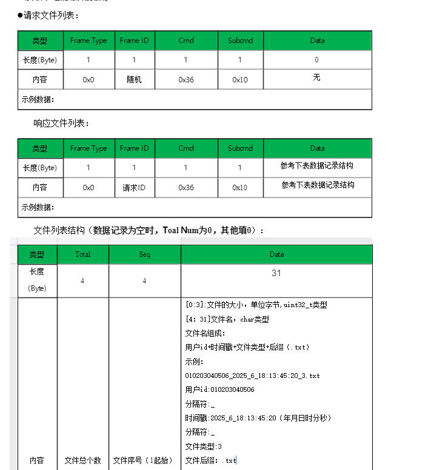
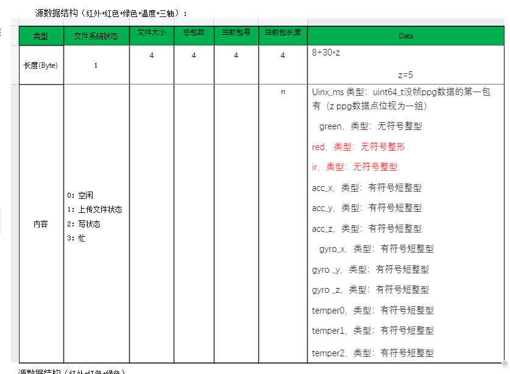
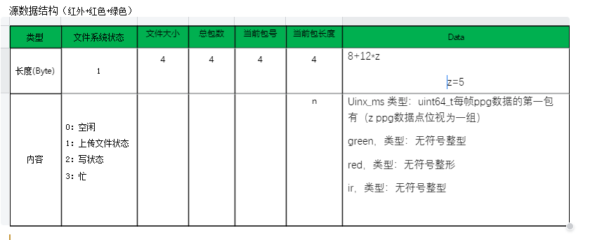
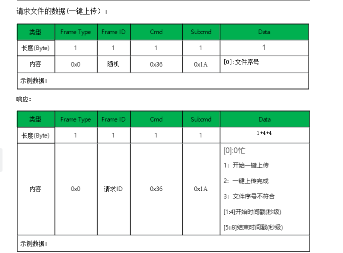
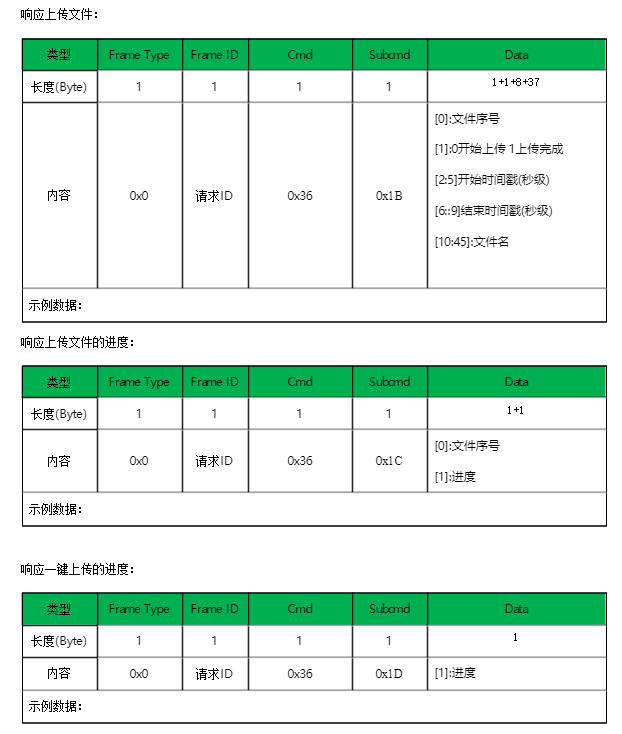
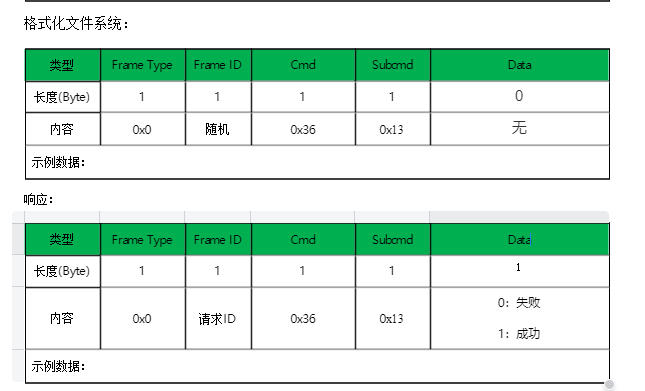

# 文件系统

### 一般指令

这种属于通用的文件系统，需要固件支持

**android:**

通过指令，可以获取戒指本地的文件列表，然后通过文件名，解析文件的内容(需要戒指支持指令) 对应的指令是：LmAPILite

```java
  /**
     *请求文件列表(指令3610)
     */
 public static void GET_FILE_LIST(FileResponseCallback fileResponse)
  /**
     *请求文件的数据(指令3611)
     */
 public static void DOWNLOAD_FILE(byte[] fileName,FileResponseCallback fileResponse)
```

GET\_FILE\_CONTENT的参数需要依赖GET\_FILE\_LIST的file回调，根据String fileName解析最后一个下划线后的类型，传给mFileType，比如：类型和文件名的最后一部分保持一致，EDB435685884\_10FF0A68\_7.txt，类型是7 byte\[] fileName是file回调里的byte\[] rawDataByte 回调

根据文件名获取后缀名的样例：

```java
// 去掉文件扩展名
      String withoutExtension = fileName.substring(0, fileName.lastIndexOf(".txt"));
      // 分割字符串
     String[] parts = withoutExtension.split("_");
     // 获取最后一个部分，即 "7"
     String fileType= parts[parts.length - 1];
     
```

目前支持的文件类型：

1:三轴数据

2:六轴数据

3:PPG数据红外+红色+三轴(spo2)

4:PPG数据绿色

5:PPG数据红外

6:温度数据红外

7:红外+红色+绿色+温度+三轴

8:adpcm音频单声道

9:opus音频

A:攀岩项目日志

B:按键捕获adpcm音频

C:按键捕获opus音频

D:adpcm双声道

### 删除文件

```java
/**
 *删除文件(指令3612)
 */
public static void DELETE_FILE(byte[] fileName, FileResponseCallback listenerLite)
```

### 格式化文件系统

```java
/**
 *格式化文件系统(指令3613)
 */
public static void PERFORM_FORMAT_FILESYSTEM(FileResponseCallback fileResponse)
```

### 获取文件系统状态（存储空间）

```java
/**
 *获取文件系统空间信息(指令3614)
 */
public static void GET_FILE_MEMORY(FileResponseCallback fileResponse) 
```

### 请求文件的数据(一键上传）

```java
/**
 *请求文件的数据(一键上传）指令361A
 */
public static void DOWNLOAD_ALL_FILES(FileResponseCallback fileResponse)
```

### 断点续传

```java
/**
 * 断点续传(指令3618)
 * @param offset 文件偏移数据量，用于断点续传
 * @param fileName 文件名
 * @param fileResponse
 */
public static void RESUME_BREAKPOINT(long offset,byte[] fileName,FileResponseCallback fileResponse)
```

### 获取文件系统状态

```java
/**
 *获取文件系统状态
 */
public static void GET_FILE_STATE(FileResponseCallback fileResponse)
```

### app回复响应(是否可以上传) 戒指主动推送文件

```java
/**
 * app回复响应(是否可以上传) 戒指主动推送文件 指令361E
 * @param canUpload 1可以开始上传，0不可以
 * @param fileNameByte 文件名
 */
public static void FILE_PUSH_APP_ANSWER(int canUpload,byte[] fileNameByte)
```

### app回复响应（是否接收完成）戒指主动推送文件

```java
/**
 * app回复响应（是否接收完成）
 * @param finish 1已完成，0未完成且需重新上传
 * @param fileNameByte 文件名
 */
public static void FILE_PROGRESS_APP_ANSWER(int finish,byte[] fileNameByte)
```

### 文件系统的回调

````java
/**
 * 接收文件系统的原始值，byte[]的前四位是指令标志位，可以忽略，从第4字节开始解析
 * <p>
 * ## 3610 文件列表解析示例
 * <p>
 * ### 字段说明
 * | 字段 | 说明 |
 * |------|------|
 * | fileCount | 文件总个数 |
 * | fileIndex | 文件序号 |
 * | fileSize | 文件大小 |
 * | fileName | 文件名称 |
 * | rawDataByte | 文件名称原始数组 |
 * <p>
 * ### 解析方法
 * ```java
 * byte[] fileCountByte = new byte[4];
 * System.arraycopy(data, 4, fileCountByte, 0, fileCountByte.length);
 * int fileCount = DataCovertUtils.byteArray2LittleInt(fileCountByte);
 *
 * byte[] fileIndexByte = new byte[4];
 * System.arraycopy(data, 8, fileIndexByte, 0, fileCountByte.length);
 * int fileIndex = DataCovertUtils.byteArray2LittleInt(fileIndexByte);
 *
 * byte[] fileSizeByte = new byte[4];
 * System.arraycopy(data, 12, fileSizeByte, 0, fileSizeByte.length);
 * int fileSize = DataCovertUtils.byteArray2LittleInt(fileSizeByte) / 1024;
 *
 * byte[] fileNameByte = new byte[data.length - 16];
 * System.arraycopy(data, 16, fileNameByte, 0, fileNameByte.length);
 * ```
 * <p>
 * ### 工具方法
 * ```java
 * private int readUInt32LE(byte[] data, int offset) {
 *     if (offset + 4 > data.length) {
 *         throw new IndexOutOfBoundsException("数据不足，无法读取4字节整数");
 *     }
 *     return (data[offset] & 0xFF) |
 *             ((data[offset + 1] & 0xFF) << 8) |
 *             ((data[offset + 2] & 0xFF) << 16) |
 *             ((data[offset + 3] & 0xFF) << 24);
 * }
 * ```
 */
public interface FileResponseCallback {

    /**
     * 对应3610请求文件列表指令
     * @param data
     * Total 4字节 文件总个数
     * Seq：4字节 文件序号（1起始）
     * Data：31字节：
     * [0:3]:文件的大小，单位字节,uint32_t类型
     * [4：31]文件名，char类型
     * 文件名组成：
     * 用户id+时间戳+文件类型+后缀（.txt）
     * 示例：
     * 010203040506_2025_6_18_13_45_20_3.txt
     * 用户id:010203040506
     * 分隔符:_
     * 时间戳:2025_6_18:13:45:20（年月日时分秒）
     * 分隔符:_
     * 文件类型:3
     * 文件后缀：.txt
     */
    void onFileListReceived(byte[] data);

    /**
     * 对应3611请求文件的数据指令
     * @param data
     * 文件系统状态：1字节
     * 文件大小：4字节
     * 总包数：4字节
     * 当前包号：4字节
     * 当前包长度：4字节
     * Data：n字节：
     * [0：37]文件名，char类型
     * 文件名组成：
     * 用户id+时间戳+文件类型+后缀（.bin）
     * 示例：
     * 010203040506_2025_6_18:13:45:20_3.bin
     * 用户id:010203040506
     * 分隔符:_
     * 时间戳:2025_6_18:13:45:20（年月日时分秒）
     * 分隔符:_
     * 文件类型:3
     * 文件后缀：.bin
     *
     * 示例：
     *                 int offset = 4;
     *                 int fileStatus = data[offset] & 0xFF;
     *                 offset += 1;
     *                 int fileSize = readUInt32LE(data, offset);
     *                 offset += 4;
     *                 int totalPackets = readUInt32LE(data, offset);
     *                 offset += 4;
     *                 int currentPacket = readUInt32LE(data, offset);
     *                 offset += 4;
     *                 int currentPacketLength = readUInt32LE(data, offset);
     *                 offset += 4;
     *                 byte[] contentDataByte = new byte[data.length - 4 - 17];
     *                 System.arraycopy(data, 21, contentDataByte, 0, contentDataByte.length);
     */
    void onFileInfoReceived(byte[] data);
    /**
     * 对应3612删除
     * @param success 删除文件是佛成功
     * @param deleteStatus
     * 0：失败
     * 1：成功
     * 2：文件繁忙
     */
    void onFileDelete(boolean success,int deleteStatus);
    /**
     *对应361D响应一键上传的进度
     * @param data
     */
    void onFileDownloadEndReceived(byte[] data);

    /**
     *对应361C一键下载，每个文件的进度
     * @param data
     */
    void onDownloadAllFileProgress(byte[] data);

    /**
     *单文件下载成功回调

     */
    void oneFileDownloadSuccess();

    /**
     *对应361A请求文件的数据(一键上传）
     * @param data
     * [0]:0忙
     * 1：开始一键上传
     * 2：一键上传完成
     * 3：文件序号不符合
     * [1:4]开始时间戳(秒级)
     * [5::8]结束时间戳(秒级)
     */
    void onDownloadStatusReceived(byte[] data);

    /**
     * 对应3611请求文件的数据
     * @param data
     * [0：37]文件名，char类型
     * 文件名组成：
     * 用户id+时间戳+文件类型+后缀（.bin）
     * 示例：
     * 010203040506_2025_6_18:13:45:20_3.bin
     * 用户id:010203040506
     * 分隔符:_
     * 时间戳:2025_6_18:13:45:20（年月日时分秒）
     * 分隔符:_
     * 文件类型:3
     * 文件后缀：.bin
     * 具体解析参照：LmApiDataUtils类
     */
    void onFileDataReceived(byte[] data);
    /**
     * 对应3617获取文件系统状态
     * @param data
     * 0：空闲
     * 1：上传文件中
     * 2：写状态
     * 3：忙
     */
    void onFileState(int data);

    /**
     * 对应361E戒指主动推送文件（推送文件名）
     * @param data
     * [0]:文件名长度
     * [1:38]:文件名
     */
    void onFilePushFileName(byte[] data);

    /**
     * 对应361F戒指主动推送文件内容
     * @param data
     *[0]:文件名长度
     * [1:38]:文件名
     */
    void onFilePushFileData(byte[] data);

    /**
     * 对应3618戒指断点续传
     * @param state 1开始上传文件 2上传文件完成
     * @param startTime 开始时间戳(秒级)
     * @param endTime 结束时间戳(秒级)
     */
    void onFileResumeBreakpoint(int state,long startTime,long endTime);

    /**
     * 对应3619戒指进度
     * @param progress 进度
     */
    void onFileResumeBreakpointProgress(int progress);
    /**
     * 获取文件系统空间信息
     * @param capacitySize 总空间大小
     * @param capacitySizeUsed 已使用空间大小
     * @param capacitySizeNotUsed 未使用空间大小
     */
    void localMemoryFull(int capacitySize,int capacitySizeUsed,int capacitySizeNotUsed);

}

````

### 本地录音文件

特定戒指支持开启和停止录音，将录音文件保存到戒指本地，可以通过指令，获取文件列表，后缀是8的文件是adpcm音频单声道格式，后缀D的是adpcm双声道，可以获取文件内容，是byte\[]类型，调用sdk的解码方法，解码成pcm格式，保存到本地的pcm文件里。

#### 录音

开启和停止录音的指令LmAPILite或者LmAPI

```java
    /**
     * 开始或者停止录音
     * @param start 开始录音
     * @param totalDuration 总录音时长，单位s
     * @param segmentTime 切片保存时长，单位s
     * @param mIAudioListenerLite
     */
CMD_START_STOP_RECORDING(boolean start,int totalDuration,int segmentTime,IAudioListenerLite mIAudioListenerLite)
```

录音对应的回调是

```java
/**
 * 开始/停止录音
 */
void recordingResult(boolean result);
```

解码：

```java
private AdPcmTool adPcmTool = new AdPcmTool();
 /**
     * 转换单个数据包
     */
    private byte[] convertPacket(byte[] tcpData,int audioType) throws Exception {
        // 提取ADPCM数据（从第21字节开始）
        if (tcpData.length <= 21) {
            return new byte[0];
        }

        int adpcmLength = tcpData.length - 21;
        byte[] adpcmData = new byte[adpcmLength];
        System.arraycopy(tcpData, 21, adpcmData, 0, adpcmLength);
        if(audioType==2){//双声道
            return adPcmTool.decodeADPCMDualChannel(adpcmData,adpcmLength);
        }
        return adPcmTool.decodeADPCMMonoChannel(adpcmData,adpcmLength);
    }
```

实时获取的音频，sdk里已经解码了，直接保存到pcm文件即可，具体使用参照


[yu-yin-lu-zhi.md](yu-yin-lu-zhi.md)


### 文件系统获取和解析

目前只支持固件版本号为1.14.的戒指，支持主动采集数据，还有自动采集数据两种模式

**android:**

如果是用户手动采集，流程是先调用开始采集的指令：

```java
public class ExerciseConfig {

    public int totalDuration = 300;     // 总采集时长，默认为5分钟（秒）
    public int segmentTime = 60;        // 每段时间，默认为60秒
    public boolean autoStart = false;   // 是否自动开始
    public boolean enableRest = true;   // 是否启用休息间隔
    public int restTime = 30;           // 休息时间，默认为30秒

    // 获取总段数
    public int getTotalSegments() {
        return (totalDuration + segmentTime - 1) / segmentTime; // 向上取整
    }

    // 获取运动描述信息
    public String getExerciseDescription() {
        return String.format("总时长: %d分%d秒，每段: %d秒，共%d段",
                totalDuration / 60, totalDuration % 60, segmentTime, getTotalSegments());
    }
}

```

可以根据实际需求，定制采集时间和时长，定制自定义指令，然后发送开启采集的指令

```java
  LmAPILite.START_EXERCISE(config);
```

可以手动停止采集

```java
 LmAPILite.STOP_EXERCISE();
```

如果戒指支持自动采集，直接进入获取文件的流程：

```java
  LmAPILite.GET_FILE_LIST(fileResponseCallback);
```


文件内容有多种，根据文件名获取后缀，每种后缀对应不同的解析方式，根据文件名获取后缀名的样例：

```java
      // 去掉文件扩展名
      String withoutExtension = fileName.substring(0, fileName.lastIndexOf(".txt"));
      // 分割字符串
     String[] parts = withoutExtension.split("_");
     // 获取最后一个部分，即 "8"
     String fileType= parts[parts.length - 1];
          
```

因篇幅限制，不会把所有解析都写在文档里，可以加入技术对接群，本公司提供蓝牙协议文档，技术人员可以提供解析样例代码

类型是7的文件内容解析样例：

```java
 public void onFileDataReceived(byte[] data) 这个回调里会返回文件原始值，然后下边是解析：
 
 byte[] contentDataByte=new byte[data.length - 4-17];
 System.arraycopy(data, 21, contentDataByte, 0, contentDataByte.length);
```

固件为了传输速度，每一条数据并不是标准的解析长度，所以要把所有文件内容保存到本地txt文件里，读取完以后，再次读取出来解析，文件内容，每条长度是158

```java
  String safeFileName = fileInfo.fileName.replace(":", "_");
                List<String[]> allContent = new ArrayList<>();

                String fileType= FileUtils.getFileType(safeFileName);
                //先清理txt缓存的内容
                CsvWriter.clearOutputFile(RingFileListActivity.this,safeFileName);
                // 1. 先收集所有数据
                for (int i = 0; i < fileInfo.fileDataPackets.size(); i++) {
                    byte[] packetData = fileInfo.fileDataPackets.get(i);
                    byte[] contentDataByte = new byte[packetData.length - 17];
                    System.arraycopy(packetData, 17, contentDataByte, 0, contentDataByte.length);
                    List<String[]> fileContent = new ArrayList<>();
                    if(fileType.equals("7")){

                        String str_data = CMDUtils.toHexString(contentDataByte);
                        Logger.show("文件采集", "===文件内容=== " + str_data);

                        CsvWriter.appendToTxt(RingFileListActivity.this, safeFileName,str_data);
                        //fileContent = LmApiDataUtils.fileContentQingHua(contentDataByte);
                    }else if(fileType.equals("9")){
                        fileContent = LmApiDataUtils.fileContentType9(contentDataByte);
                        allContent.addAll(fileContent);

                    }
                }
                //是7类型，从缓存里获取所有数据
                if(fileType.equals("7")) {
                    String fromTxt = CsvWriter.readFromTxt(RingFileListActivity.this, safeFileName);
                    //每158个字节转码一次
                    byte[] bytes = CMDUtils.hexString2Bytes(fromTxt);

                    // 存储所有转换结果的列表
                    List<List<String[]>> allResults = new ArrayList<>();

                    // 计算总段数
                    int totalSegments = bytes.length / 158;

                    // 按158字节分段处理
                    for(int i = 0; i < totalSegments; ++i) {
                        // 计算当前段的起始位置
                        int start = i * 158;
                        int end = Math.min(start + 158, bytes.length);

                        // 提取当前158字节段
                        byte[] segment = new byte[end - start];
                        System.arraycopy(bytes, start, segment, 0, segment.length);

                        // 对当前段进行转码
                        List<String[]> segmentResult = LmApiDataUtils.fileContentQingHua(segment);
                        allResults.add(segmentResult);
                    }
                    //合并到一个列表
                    for(List<String[]> segmentList : allResults) {
                        if(segmentList != null) {
                            allContent.addAll(segmentList);
                        }
                    }


                }
```

解析内容源码，可以自己改造成需要的：

```java
//完整信息内容解析
     public static List<String[]> fileContentQingHua(byte[] contentByte) {

        byte[] timestamp=new byte[8];
        System.arraycopy(contentByte, 0, timestamp, 0, timestamp.length);
        Date date = bytesToTimestampSmall(timestamp);
        SimpleDateFormat sdf = new SimpleDateFormat("yyyy-MM-dd HH:mm:ss");
        String formattedDate = sdf.format(date);

        byte[] contentDataByte=new byte[contentByte.length-8];
        System.arraycopy(contentByte, 8, contentDataByte, 0, contentDataByte.length);

        List<String[]> resultList=new ArrayList<>();
        for (int i = 0; i < contentDataByte.length / 30; i++) {
            String[] result=new String[13];
            ByteBuffer buffer = ByteBuffer.wrap(contentDataByte, i * 30, 30);
            buffer.order(ByteOrder.LITTLE_ENDIAN);

            result[0]=formattedDate;
            int greenData = buffer.getInt();
            result[1]=greenData+"";
            int redData = buffer.getInt();
            result[2]=redData+"";
            int irData = buffer.getInt();
            result[3]=irData+"";
            short accX = buffer.getShort();
            result[4]=accX+"";
            short accY = buffer.getShort();
            result[5]=accY+"";
            short accZ = buffer.getShort();
            result[6]=accZ+"";
            short  gyroX = buffer.getShort();
            result[7]=gyroX+"";
            short gyroY = buffer.getShort();
            result[8]=gyroY+"";
            short gyroZ = buffer.getShort();
            result[9]=gyroZ+"";
            // 使用无符号转换
            short temper0 = buffer.getShort();
            int unsignedTemper0 = temper0 & 0xFFFF;  // 转换为无符号整数
            result[10] = unsignedTemper0 + "";

            short temper1 = buffer.getShort();
            int unsignedTemper1 = temper1 & 0xFFFF;
            result[11] = unsignedTemper1 + "";

            short temper2 = buffer.getShort();
            int unsignedTemper2 = temper2 & 0xFFFF;
            result[12] = unsignedTemper2 + "";
            resultList.add(result);
//            str += "greenData:" + greenData + ";redData:" + redData+ ";irData:" + irData+  ";accX:" + accX + ";accY:" + accY + ";accZ:" + accZ
//                    +  ";gyroX:" + gyroX+  ";gyroY:" + gyroY+  ";gyroZ:" + gyroZ+  ";temper0:" + temper0+  ";temper1:" + temper1+  ";temper2:" + temper2
//                    + "\r\n";

        }

        return resultList;
    }
```

```java
//简化信息内容解析
 public static List<String[]> fileContentType9(byte[] contentByte) {

        byte[] timestamp=new byte[8];
        System.arraycopy(contentByte, 0, timestamp, 0, timestamp.length);
        Date date = bytesToTimestamp(timestamp);
        SimpleDateFormat sdf = new SimpleDateFormat("yyyy-MM-dd HH:mm:ss");
        String formattedDate = sdf.format(date);

        byte[] contentDataByte=new byte[contentByte.length-8];
        System.arraycopy(contentByte, 8, contentDataByte, 0, contentDataByte.length);

        List<String[]> resultList=new ArrayList<>();
        for (int i = 0; i < contentDataByte.length / 12; i++) {
            String[] result=new String[4];
            ByteBuffer buffer = ByteBuffer.wrap(contentDataByte, i * 12, 12);
            buffer.order(ByteOrder.LITTLE_ENDIAN);

            result[0]=formattedDate;
            int greenData = buffer.getInt();
            result[1]=greenData+"";
            int redData = buffer.getInt();
            result[2]=redData+"";
            int irData = buffer.getInt();
            result[3]=irData+"";
            resultList.add(result);


        }

        return resultList;
    }
```

对应参数的说明：

```java
Uinx_ms 类型：uint64_t没帧ppg数据的第一包有（z ppg数据点位视为一组）
   green，类型：无符号整型
red，类型：无符号整形
ir，类型：无符号整型
acc_x，类型：有符号短整型
acc_y，类型：有符号短整型
acc_z，类型：有符号短整型
   gyro_x，类型：有符号短整型
gyro _y，类型：有符号短整型
gyro _z，类型：有符号短整型
temper0，类型：有符号短整型
temper1，类型：有符号短整型
temper2，类型：有符号短整型

```

发送样例:

```java
//请求文件列表
  LmAPILite.GET_FILE_LIST(fileResponseCallback);
  
  //格式化文件系统
  LmAPILite.PERFORM_FORMAT_FILESYSTEM(fileResponseCallback);
  //请求文件的数据
  byte[] fileNameBytes = fileInfo.fileName.getBytes("UTF-8");
  LmAPILite.DOWNLOAD_FILE(fileNameBytes,fileResponseCallback);
  //请求文件的数据(一键上传所有文件）
   LmAPILite.DOWNLOAD_ALL_FILES(fileResponseCallback);
```

这种模式比较复杂，返回时走的回调比较多，现在把具体的文档展示一下

请求文件列表：

<figure><figcaption></figcaption></figure>

完整版文件内容

<figure><figcaption></figcaption></figure>

简化版文件内容

<figure><figcaption></figcaption></figure>

一键上传所有文件

<figure><figcaption></figcaption></figure>

响应文件上传进度

<figure><figcaption></figcaption></figure>

格式化系统

<figure><figcaption></figcaption></figure>

### iOS 获取文件列表

```swift
/// 获取文件列表
/// - Parameter completion: 获取文件列表回调
/// - BCLRequestFileListResponse: 包含获取文件列表结果的响应模型
func getFileList(completion: @escaping (Result<BCLRequestFileListResponse, BCLError>) -> Void)
```

#### 调用示例

```swift
BCLRingManager.shared.getFileList { [weak self] res in
    guard let self = self else { return }

    switch res {
    case let .success(response):
        BDLogger.info("获取文件系统列表成功: \(response)")
        BDLogger.info("文件系统列表-总个数: \(response.fileTotalCount ?? 0)")
        BDLogger.info("文件系统列表-当前索引: \(response.fileIndex ?? 0)")
        BDLogger.info("文件系统列表-文件大小: \(response.fileSize ?? 0)")
        BDLogger.info("文件系统列表-用户ID: \(response.userId ?? "")")
        BDLogger.info("文件系统列表-日期: \(response.fileDate ?? "")")
        BDLogger.info("文件系统列表-文件名: \(response.fileName ?? "")")
        BDLogger.info("文件系统列表-文件类型: \(response.fileType ?? "")")

        // 记录期望的文件总数
        if let totalCount = response.fileTotalCount, self.expectedFileCount == 0 {
            self.expectedFileCount = totalCount
            // 如果没有文件，直接提示
            if totalCount == 0 {
                BDLogger.info("当前没有文件可供下载")
                return
            }
        }

        // 收集文件信息
        if let fileName = response.fileName, !fileName.isEmpty {
            let fileInfo = FileInfoModel(
                fileName: fileName,
                userId: response.userId,
                fileDate: response.fileDate,
                fileSize: response.fileSize,
                fileType: response.fileType,
                isSelected: false
            )
            // 保存文件信息到数组

            // 检查是否已经收集完所有文件
            if self.collectedFiles.count >= self.expectedFileCount {
                BDLogger.info("所有文件信息收集完成，共 \(self.collectedFiles.count) 个文件")
            }
        }

    case let .failure(error):
        BDLogger.error("获取文件系统列表失败: \(error)")
    }
}
```

### 获取文件数据

**iOS:**

```swift
/// 获取文件数据
/// - Parameters:
///   - fileName: 文件名
///   - completion: 获取文件数据回调
/// - Result: 获取文件数据结果
/// - BCLRequestFileDataResponse: 包含获取文件数据结果的响应模型
/// - BCLError: 错误信息
func getFileData(fileName: String, completion: @escaping (Result<BCLRequestFileDataResponse, BCLError>) -> Void)
```

#### 调用示例

```swift
BCLRingManager.shared.getFileData(fileName: fileName) { res in
    switch res {
    case let .success(response):
        BDLogger.info("获取文件数据成功: \(response)")
        BDLogger.info("文件数据-状态: \(response.fileSystemStatus ?? 0)")
        BDLogger.info("文件数据-大小: \(response.fileSize ?? 0)")
        BDLogger.info("文件数据-总包数: \(response.totalNumber ?? 0)")
        BDLogger.info("文件数据-当前包号: \(response.currentNumber ?? 0)")
        BDLogger.info("文件数据-当前包长度: \(response.currentLength ?? 0)")
        guard let type = response.fileType else {
            BDLogger.info("未知的文件类型")
            return
        }
        switch type {
        case "1": BDLogger.info("文件数据:三轴数据-数据：\(response.fileDataType1 ?? [])")
        case "2": BDLogger.info("文件数据:六轴数据-数据：\(response.fileDataType2 ?? [])")
        case "3": BDLogger.info("文件数据:PPG数据红外+红色+x加速度+y加速度+z加速度-数据：\(response.fileDataType3 ?? [])")
        case "4": BDLogger.info("文件数据:PPG数据绿色-数据：\(response.fileDataType4 ?? [])")
        case "5": BDLogger.info("文件数据:PPG数据红外-数据：\(response.fileDataType5 ?? [])")
        case "6": BDLogger.info("文件数据:温度数据红外-数据：\(response.fileDataType6 ?? [])")
        case "7":
            // (时间戳,[(绿色+红色+红外+加速度X+加速度Y+加速度Z+陀螺仪X+陀螺仪Y+陀螺仪Z+温度0+温度1+温度2)])
            BDLogger.info("文件内容----时间戳：\(response.fileDataType7?.0 ?? 0)")
            BDLogger.info("文件内容----数据：\(response.fileDataType7?.1 ?? [])")
        case "8":
            // adpcm音频
            if let data = response.fileDataType8 {
                let preview = data.map { String(format: "%02x", $0) }
                BDLogger.info("文件数据:adpcm音频，大小:\(data.count)字节，字节内容:\(preview)")
            } else {
                BDLogger.info("文件数据:adpcm音频：无数据")
            }
        case "9":
            // opus音频
            if let data = response.fileDataType9 {
                let preview = data.map { String(format: "%02x", $0) }
                BDLogger.info("文件数据:opus音频，大小:\(data.count)字节，字节内容:\(preview)")
            } else {
                BDLogger.info("文件数据:opus音频：无数据")
            }
        case "10", "A", "a":
            if let climbingData = response.fileDataType10 {
                for (macAddress, utcTime, laccValue) in climbingData {
                    BDLogger.info("文件数据:攀岩项目数据，MAC:\(macAddress)，时间:\(utcTime)，LACC:\(laccValue)")
                }
            } else {
                BDLogger.info("文件数据:攀岩项目数据：无数据")
            }
        default:
            BDLogger.info("未知的文件类型")
        }
    case let .failure(error):
        BDLogger.error("获取文件数据失败: \(error)")
    }
}
```

### 删除文件

**iOS:**

```swift
/// 删除文件
/// - Parameters:
///   - fileName: 文件名
///   - completion: 删除文件回调
func deleteFile(fileName: String, completion: @escaping (Result<BCLDeleteFileResponse, BCLError>) -> Void)
```

#### 调用示例

```swift
```

### 格式化文件系统

**iOS:**

```swift
/// 格式化文件系统
/// - Parameter completion: 格式化文件系统回调
func formatFileSystem(completion: @escaping (Result<BCLFormatFileSystemResponse, BCLError>) -> Void)
```

#### 调用示例

```swift
BCLRingManager.shared.formatFileSystem { res in
    switch res {
    case let .success(response):
        if let result = response.formatResult, result == 1 {
            BDLogger.info("格式化文件系统成功: \(response)")
        } else {
            BDLogger.info("格式化文件系统失败: \(response)")
        }
    case let .failure(error):
        BDLogger.error("格式化文件系统失败: \(error)")
    }
}
```

### 获取文件系统信息

**iOS:**

```swift
/// 获取文件系统信息
/// - Parameter completion: 获取文件系统信息回调
func getFileSystemInfo(completion: @escaping (Result<BCLGetFileSystemInfoResponse, BCLError>) -> Void)
```

### 获取文件系统状态

**iOS:**

```swift
/// 获取文件系统状态
func getFileSystemStatus(completion: @escaping (Result<BCLGetFileSystemStatusResponse, BCLError>) -> Void)
```

### 自动记录采集数据模式

**iOS:**

```swift
/// 获取自动记录采集数据模式
func getAutoRecordDataMode(completion: @escaping (Result<BCLGetAutoRecordDataModeResponse, BCLError>) -> Void)

/// 设置自动记录采集数据模式
/// - Parameters:
///   - type: 0：停止自动记录采集信息、1：开启自动记录三轴信息、2：开启自动记录六轴信息、3：开启自动记录spo2信息、4：开启自动记录hr信息、5：开启自动记录红外信息、6：开启自动记温度信息
func setAutoRecordDataMode(type: Int, completion: @escaping (Result<BCLSetAutoRecordDataModeResponse, BCLError>) -> Void)
```
