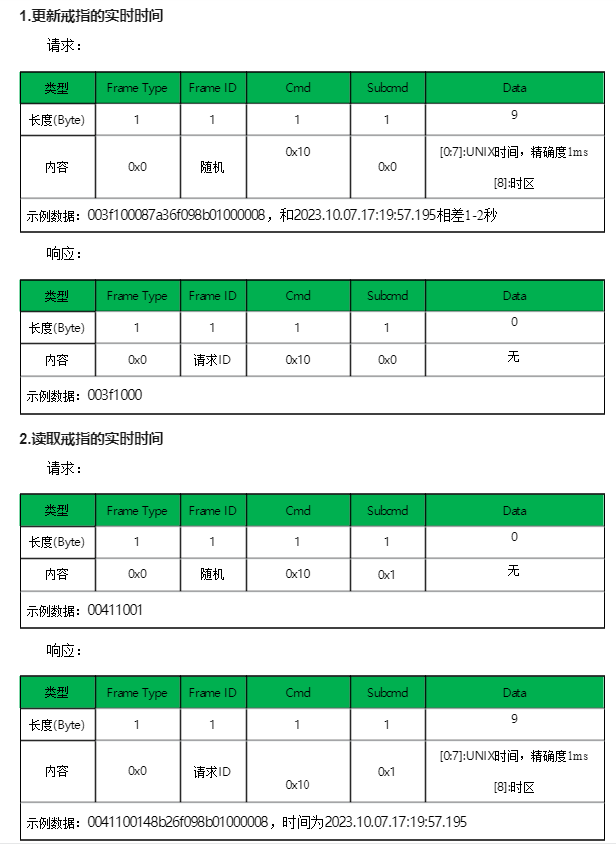
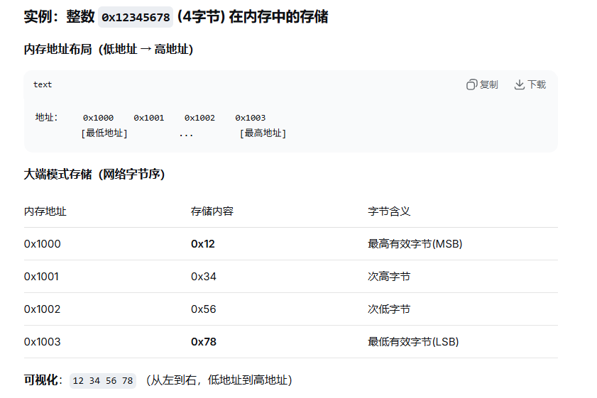
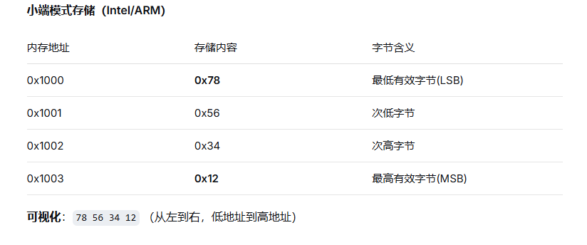

# 协议开发指南

## 以同步和获取戒指时间指令为例

<figure><figcaption></figcaption></figure>

解析样例：
\
发送指令组合：0x00，随机值，Cmd 0x10是类别，区分哪组指令，Subcmd 0x00，0x01是小类别，区分哪个指令，Data是实际数值，java代码组合如下

```java
  public static byte[] convertToBytes(int cmd, byte[] value) {
        byte[] data = new byte[3 + value.length];
        data[0] = 0x00;
        data[1] = (byte) new Random().nextInt(254);
        data[2] = (byte) cmd;
        System.arraycopy(value, 0, data, 3, value.length);
        return data;
    }
```

发送样例:

```java
   /**
     * 发送指令
     */
    public static void SEND_CMD(byte[] data) {
       
        BLEService.sendCmd(data);
    }

```

发送数据指令组合样例：

```java
 /**
     * 把一个整形改为8位的byte数组
     *
     * @param value
     * @return
     * @throws Exception
     */
    public static byte[] longTo8Bytes(long value) {
        byte[] result = new byte[8];
        result[7] = (byte) ((value >>> 56) & 0xFF);
        result[6] = (byte) ((value >>> 48) & 0xFF);
        result[5] = (byte) ((value >>> 40) & 0xFF);
        result[4] = (byte) ((value >>> 32) & 0xFF);
        result[3] = (byte) ((value >>> 24) & 0xFF);
        result[2] = (byte) ((value >>> 16) & 0xFF);
        result[1] = (byte) ((value >>> 8) & 0xFF);
        result[0] = (byte) (value & 0xFF);
        return result;
    }
```

同步当前时间到戒指：

```java
 public static void SYNC_TIME_ZONE(byte zone) {
        long currentTimeMillis = TimeUtils.getTimeWithZone();
        byte[] bytes = ConvertUtils.longTo8Bytes(currentTimeMillis);
        byte[] data = new byte[10];
        data[0] = 0x00;
        System.arraycopy(bytes, 0, data, 1, bytes.length);
        data[9] = zone;
        SEND_CMD(convertToBytes(0x10, data));
    }
```

获取戒指时间：

```java
 /**
     * 读取时间
     */
    public static void READ_TIME() {
        SEND_CMD(convertToBytes(0x10, new byte[]{0x01}));
    }
```

指令返回解析样例：

```java

public interface ISyncTimeListenerLite {

    /**
     * 同步时间
     * @param updateTime true是同步时间，false是读取时间
     * @param timeStamp 读取操作获取的戒指的时间戳
     * @param timeZone 读取操作获取的戒指的时区
     */
    void syncTime(boolean updateTime,long timeStamp,long timeZone);
}

```

```java
 
 switch (data[2]) {
                case CMD_SYNC_TIME:
                    if(iSyncTimeListenerLite!=null){

                            if(data[3]==0){
                                iSyncTimeListenerLite.syncTime(true,0,0);
                            }else{
                                byte[] timeBytes = new byte[8];
                                System.arraycopy(data, 4, timeBytes, 0, timeBytes.length);

                                iSyncTimeListenerLite.syncTime(false,ConvertUtils.BytesToLong(timeBytes),data[12]);
                            }

                    }
                    break;
```

除非特殊规定，发送的指令都是小端模式，

<figure><figcaption></figcaption></figure>

<figure><figcaption></figcaption></figure>
